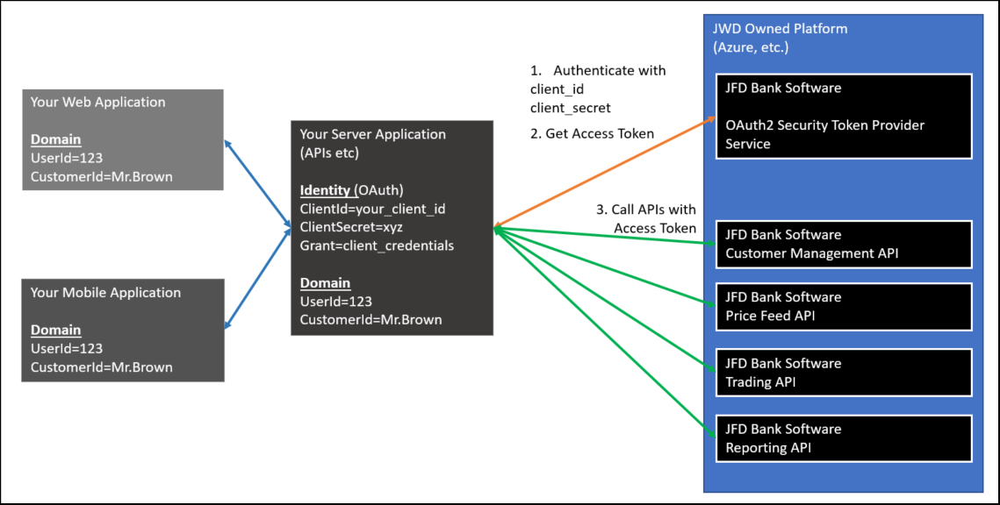
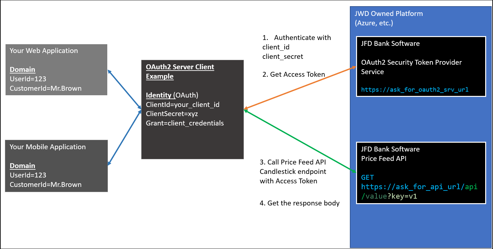

 

# Java OAuth2 Server Client Example: Environment Setup, Configurations and Deployment

**NOTE:** 

1. To debug the project, make sure that you have your `client_id`, `client_secret`, `scope` from JFD Bank .
 
2. This client has to be defined as a client on OAuth2 Security Token Provider Service of JFD Bank.  

3. To debug the project, one of our APIs is required to be given required permissions and `scope`.

 

## 1. Preliminary

This project is a Maven project based on Java Spring Boot.

This project is an example for a server based application that calls JFD Bank API which are protected by OAuth2.

To call the endpoints of the JFD Bank APIs, this app first needs to obtain an access token from OAuth2 Security Token Provider Service of JFD Bank.

1. This app calls OAuth2 Security Token Provider Service of JFD Bank in order to get an access token
 
2. Then, this application uses obtained access token to get authorized for calling the endpoints of the JFD Bank APIs.

NOTE: Please check important notices section at the end of this document.

 

## 2. Details

This project has examples for 2 different methods of OAuth 2 usage for Spring Boot framework.

The general picture is as follows:

&ensp;**2.1. Using **`RestTemplate`** **

If your Spring Boot usage will facilitate RestTemplate, then you can use this method.

It has a Bean configuration defined in `OAuth2ClientWithRestTemplateConfiguration`.

RestTemplate method usage is demonstrated in `OAuth2ApiCallWithRestTemplateRestController`.

In `OAuth2ApiCallWithRestTemplateRestController` there are 2 methods that you can use as an example OAuth 2 flow:

1. `getCandlestickChartDataViaRestTemplate()` method uses AuthorizedClientServiceAndManager in order to authenticate.

&ensp; * You can see this as a GET example for your own Server API Application, which calls a JFD Bank API and serves your own web/mobile apps.

&ensp; * Obtains an `Access Token` from OAuth 2 Security Token Provider Service.

&ensp; * Then uses that `Access Token` in order to call PriceFeed API Candlestick endpoint url via `RestTemplate`.

&ensp; * This method will call PriceFeed API Candlestick endpoint url and get a recent price data of a financial instrument identified by its ISIN code.  
 

2. `postIsinCodeToGetCandlestickChartDataViaRestTemplate()` method uses AuthorizedClientServiceAndManager in order to authenticate.

&ensp; * You can see this as a POST example for your own Server API Application, which calls a JFD Bank API and serves your own web/mobile apps.

&ensp; * Obtains an `Access Token` from OAuth 2 Security Token Provider Service.

&ensp; * Then uses that `Access Token` in order to call PriceFeed API Candlestick endpoint url via `RestTemplate`.

&ensp; * This method will call PriceFeed API Candlestick endpoint url and get a recent price data of a financial instrument identified by its ISIN code.  
 

 
&ensp;**2.2. Using **`WebClient`** **

If your Spring Boot usage will facilitate `WebClient`, then you can use this method.

It has a Bean configuration defined in `OAuth2ClientWithWebClientConfiguration`.

RestTemplate method usage is demonstrated in `OAuth2ApiCallWithWebClientRestController`.

In `OAuth2ApiCallWithWebClientRestController` there is 3 methods that you can use as an example OAuth 2 flow:

1. `getCandlestickChartDataViaWebClient()` method uses `WebClient` in order to authenticate.

&ensp; * You can see this as a GET example for your own Server API Application, which calls a JFD Bank API and serves your own web/mobile apps.

&ensp; * Obtains an `Access Token` from OAuth 2 Security Token Provider Service.

&ensp; * Then uses that `Access Token` in order to call PriceFeed API Candlestick endpoint url via `WebClient`.

&ensp; * This method will call PriceFeed API Candlestick endpoint url and get a recent price data of a financial instrument identified by its ISIN code.  
 

2. `postIsinCodeToGetCandlestickChartDataViaWebClient()` method uses `WebClient` in order to authenticate.

&ensp; * You can see this as a POST example for your own Server API Application, which calls a JFD Bank API and serves your own web/mobile apps.

&ensp; * Obtains an `Access Token` from OAuth 2 Security Token Provider Service.

&ensp; * Then uses that `Access Token` in order to call PriceFeed API Candlestick endpoint url via `WebClient`.

&ensp; * This method will call PriceFeed API Candlestick endpoint url and get a recent price data of a financial instrument identified by its ISIN code.  
 

3. `scheduledPriceFeeAPICandlestickRequest()` a scheduled method which uses `WebClient` in order to authenticate.

## 3. Important Notice on Access Token Lifetime

 

`Access Token` obtained from OAuth 2 Security Token Provider Service has a lifetime.

If this lifetime ends, you need to get another `Access Token` or you may need refresh this token.

For now, testing purposes, you need to **cache** this `Access Token` so that you use this until just before the lifetime expires.

 

## 4. Important Notice on client_id, client_secret and scopes

 

Please ask JFD Bank for client_id, client_secret and scopes in order to be able to test access to authorized API calls.

 

